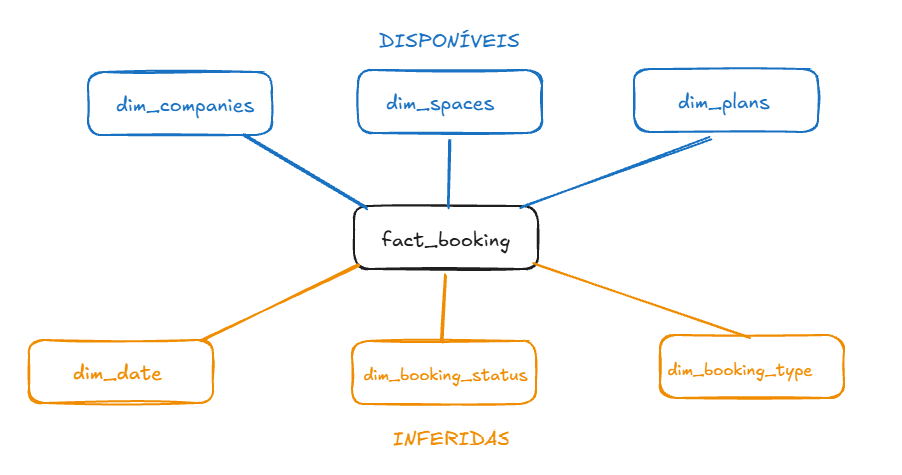

# woba-bookings-analytics

Camada semântica para o domínio de bookings da Woba utilizando dbt, Athena e Iceberg. Foco em modelagem dimensional, qualidade analítica e suporte a BI e produtos de dados.

---

## Estrutura do projeto

O projeto segue o padrão medalhão:

* bronze: dados brutos (sources)
* silver: limpeza e padronização (staging)
* gold: camada de consumo (dimensões, fato e modelo analítico)

A camada gold é modelada em Star Schema.

Obs: A separação entre bronze/silver/gold pode variar entre organizações. Neste projeto, bronze foi tratado como source, silver como staging e gold como camada de consumo.

---

## Parte 1 — Modelagem Dimensional

A modelagem segue o padrão **Star Schema**, com uma tabela fato central (`fact_bookings`) e dimensões associadas.

### Grain

1 linha = 1 booking (`booking_id`)

---

### Estrutura do modelo

#### Fato

* `fact_bookings`  
  Representa cada reserva realizada.

Principais chaves:

* booking_id (degenerate dimension)
* space_id, company_id, user_id, plan_id

Obs: `user_id` é mantido diretamente na fato como **degenerate dimension**, sem dimensão dedicada.

---

#### Dimensões

**Disponíveis:**

* `dim_spaces`
* `dim_companies`
* `dim_plans`

**Inferidas (a partir do schema):**

* `dim_booking_status` → domínio controlado a partir de `status_id`
* `dim_booking_type` → categorização de reservas
* `dim_date` → suporte a agregações temporais

---

### Decisões de modelagem

* **Star Schema**: simplifica consumo em BI e reduz complexidade de joins
* **Degenerate dimension**: `booking_id` e `user_id` mantidos na fato para rastreabilidade e simplicidade
* **Relacionamentos**: modelo estruturado em relações 1:N entre dimensões e fato

#### Star Schema vs OBT

O modelo foi construído em Star Schema para atender à proposta do case.

Na prática, uma abordagem em OBT costuma ser mais eficiente e simples para consumo, pois evita múltiplos joins (reduzindo custo de processamento) e facilita o uso por usuários finais ao concentrar os dados em uma única tabela. Há um aumento no uso de armazenamento, porém, via de regra, esse custo é inferior ao custo de processamento gerado por múltiplos joins.

#### Estratégia de SCD

A definição considera a necessidade de preservar o contexto histórico no momento da reserva:

* `dim_spaces` → **SCD Type 2**  
Mudanças em atributos como capacidade, categoria e tier impactam a análise histórica.

* `dim_plans` → **SCD Type 2**  
Planos impactam diretamente créditos e regras de uso.

* `dim_companies` → **SCD Type 1 (evolutivo)**  
Pode evoluir para SCD2 caso atributos como porte da empresa sejam relevantes.

* `dim_booking_status` e `dim_booking_type` → **SCD Type 0**  
Domínios estáticos.

* `dim_date` → **Tabela estática (sem SCD)**  
Calendário gerado previamente, sem necessidade de controle de histórico.

#### Observações de modelagem

Algumas dimensões inferidas (como status e tipo de booking) utilizam mapeamentos hipotéticos para enriquecimento semântico.

Esses valores foram definidos via `case when` com base em interpretação do domínio e devem ser validados com o time de produto antes de uso em produção.

A dimensão de datas é tratada como tabela estática (tag `static`), sendo atualizada apenas sob demanda.

---

## Dados faltantes e como seriam obtidos

Para completar o modelo, seria necessário:

* tabela de usuários (`users`)
* definição dos status de booking
* regras de cancelamento e no-show
* histórico de mudanças dos espaços (fonte para SCD2)
* definição de `credits` e sua conversão

### Abordagem

* alinhamento com produto para entendimento das regras de negócio
* alinhamento com engenharia de software para entender origem e lifecycle dos dados
* validação com stakeholders de dados para definição de métricas
* análise exploratória das tabelas brutas

---

## Consumo downstream (BI e Produto)

### BI

A modelagem em Star Schema facilita:

* agregações por empresa, plano e período
* definição consistente de métricas
* simplificação de joins

---

### Produto / IA

Para suportar casos como recomendação de espaços:

* necessidade de granularidade por usuário
* uso de histórico para entendimento de comportamento
* criação de features (frequência, preferências, localização)

Impactos na modelagem:

* preservação do nível transacional na fato
* uso de `user_id` diretamente na fato (degenerate dimension)
* possibilidade de evolução para uma dimensão de usuários caso atributos adicionais estejam disponíveis
* possibilidade de evolução para dados mais granulares (eventos)

---

## Parte 2 — Implementação com dbt

O projeto foi estruturado com dbt considerando:

* organização por camadas (bronze, silver, gold)
* uso de `source()` para dados brutos e `ref()` para dependências
* materializações:

  * view para staging (silver)
  * table para dimensões
  * incremental com merge para fatos
* uso de Iceberg para suportar operações de merge

### Estratégia incremental

O modelo `fact_bookings` utiliza:

* `materialized = incremental`
* `unique_key = booking_id`
* estratégia `merge`

A carga incremental é controlada via timestamp (`created_at`), reduzindo leitura de dados no Athena.

---

### Query analítica

Foi desenvolvido um modelo para responder:

"Qual a taxa de utilização de créditos por empresa nos últimos 3 meses, segmentada por plano, e como se compara com a média geral?"

Definição utilizada:

credits utilizados / créditos disponíveis no plano

---

### Testes

Foram implementados testes de qualidade de dados em dois níveis:

**Testes genéricos:**

* `not_null`
* `unique`
* `relationships`
* `accepted_values`

**Teste customizado:**

* reservas canceladas não devem possuir check-in registrado

---

### Execução e monitoramento de testes

Os testes são executados via `dbt test` (ou `dbt build`) após a materialização dos modelos.

Em produção, essa execução seria orquestrada via Airflow, onde falhas interrompem o pipeline e disparam alertas, evitando propagação de dados inconsistentes.

---

### Macro

Foi criada uma macro para controle de carga incremental baseada em timestamp, reutilizada em modelos incrementais para reduzir custo de leitura no Athena.

---

## Parte 3 — Dados como Produto

xxxxxxxxxxx

---

## Parte 4 — Bônus

xxxxxxxxxxx

---
