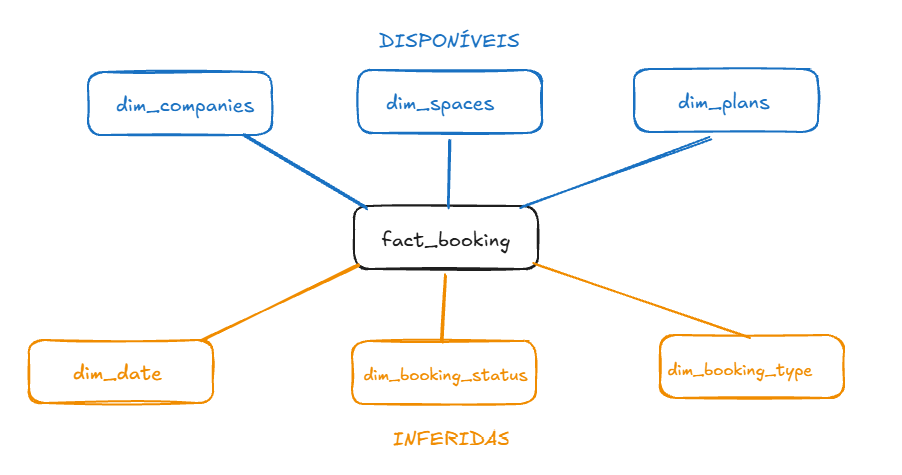
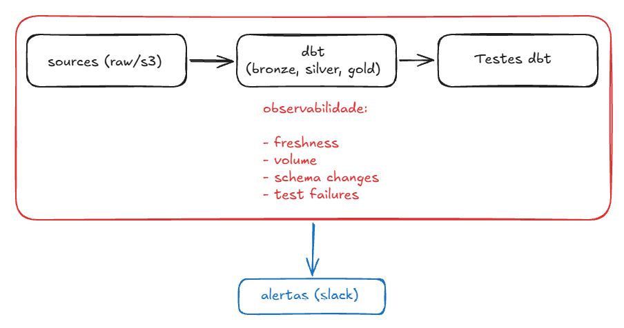

# woba-bookings-analytics

Camada semântica para o domínio de bookings da Woba utilizando dbt, Athena e Iceberg. Foco em modelagem dimensional e suporte a consumo em BI e produtos de dados.

---

## Estrutura do projeto

O projeto segue o padrão medalhão:

* bronze: dados brutos (sources)
* silver: limpeza e padronização (staging)
* gold: camada de consumo (dimensões, fato e modelo analítico)

A camada gold é modelada em Star Schema.

Neste projeto, bronze foi tratado como source, silver como staging e gold como camada de consumo.

---

# Parte 1 — Modelagem Dimensional

A modelagem segue o padrão **Star Schema**, com uma tabela fato central (`fact_bookings`) e dimensões associadas.

### Grain

1 linha = 1 booking (`booking_id`)

---

### Estrutura do modelo

#### Fato

* `fact_bookings`  
  Cada linha representa uma reserva (booking).

Principais chaves:

* booking_id (degenerate dimension)
* space_id, company_id, user_id, plan_id

Obs: `user_id` é mantido diretamente na fato como **degenerate dimension**, sem dimensão dedicada.

---

#### Dimensões

**Disponíveis:**

* `dim_spaces`
* `dim_companies`
* `dim_plans`

**Inferidas (a partir do schema):**

* `dim_booking_status` → domínio controlado a partir de `status_id`
* `dim_booking_type` → categorização de reservas
* `dim_date` → suporte a agregações temporais

---

### Decisões de modelagem

* **Star Schema**: simplifica consumo em BI e reduz complexidade de joins
* **Degenerate dimension**: `booking_id` e `user_id` mantidos na fato para rastreabilidade e simplicidade
* **Relacionamentos**: modelo estruturado em relações 1:N entre dimensões e fato

#### Star Schema vs OBT

O modelo foi construído em Star Schema para atender à proposta do case.

Na prática, uma abordagem em OBT costuma ser mais eficiente e simples para consumo, pois evita múltiplos joins (reduzindo custo de processamento) e facilita o uso por usuários finais ao concentrar os dados em uma única tabela. Há um aumento no uso de armazenamento, porém, via de regra, esse custo é inferior ao custo de processamento gerado por múltiplos joins.

#### Estratégia de SCD

A definição considera a necessidade de preservar o contexto histórico no momento da reserva:

* `dim_spaces` → **SCD Type 2**  
Mudanças em atributos como capacidade, categoria e tier impactam a análise histórica.

* `dim_plans` → **SCD Type 2**  
Planos impactam diretamente créditos e regras de uso.

* `dim_companies` → **SCD Type 1 (evolutivo)**  
Pode evoluir para SCD2 caso atributos como porte da empresa sejam relevantes.

* `dim_booking_status` e `dim_booking_type` → **SCD Type 0**  
Domínios estáticos.

* `dim_date` → **Tabela estática (sem SCD)**  
Calendário gerado previamente, sem necessidade de controle de histórico.

#### Observações de modelagem

Algumas dimensões (como status e tipo de booking) foram inferidas a partir do contexto. Em um cenário real, validaria essas definições com o time de produto.

A dimensão de datas é tratada como tabela estática (tag `static`), sendo atualizada apenas sob demanda.

---

## Dados faltantes e como seriam obtidos

Para completar o modelo, eu buscaria:

* tabela de usuários (`users`)
* definição dos status de booking
* regras de cancelamento e no-show
* histórico de mudanças dos espaços (fonte para SCD2)
* definição de `credits` e sua conversão

### Abordagem

* alinhamento com produto para entendimento das regras de negócio
* alinhamento com engenharia de software para entender origem e lifecycle dos dados
* validação com stakeholders de dados para definição de métricas
* análise exploratória das tabelas brutas

---

## Consumo downstream (BI e Produto)

### BI

O modelo foi pensado para facilitar consumo em BI, principalmente para:

* agregações por empresa, plano e período
* definição consistente de métricas
* simplificação de joins

---

### Produto / IA

Pensando em casos como recomendação de espaços:

* necessidade de granularidade por usuário
* uso de histórico para entendimento de comportamento
* criação de features (frequência, preferências, localização)

Impactos na modelagem:

* preservação do nível transacional na fato
* uso de `user_id` diretamente na fato (degenerate dimension)
* possibilidade de evolução para uma dimensão de usuários caso atributos adicionais estejam disponíveis
* possibilidade de evolução para dados mais granulares (eventos)

---

# Parte 2 — Implementação com dbt

O projeto foi estruturado em dbt com:

* organização por camadas (bronze, silver, gold)
* uso de `source()` para dados brutos e `ref()` para dependências
* materializações:

  * view para staging (silver)
  * table para dimensões
  * incremental com merge para fatos
* uso de Iceberg para suportar operações de merge

### Estratégia incremental

O modelo `fact_bookings` utiliza:

* `materialized = incremental`
* `unique_key = booking_id`
* estratégia `merge`

A carga incremental é controlada via timestamp (`created_at`), reduzindo leitura de dados no Athena.

---

### Query analítica

Modelo desenvolvido para responder:

"Qual a taxa de utilização de créditos por empresa nos últimos 3 meses, segmentada por plano, e como se compara com a média geral?"

Definição utilizada:

credits utilizados / créditos disponíveis no plano

---

### Script Python

Script simples para consumir o output da query analítica.

* lê o resultado (CSV)
* filtra empresas com usage_rate < 30%
* gera um CSV com candidatos a churn

Simula consumo downstream fora do BI.

---

### Testes

Foram implementados testes de qualidade de dados em dois níveis:

**Testes genéricos:**

* `not_null`
* `unique`
* `relationships`
* `accepted_values`

**Teste customizado:**

* reservas canceladas não devem possuir check-in registrado

---

### Execução e monitoramento de testes

Os testes são executados via `dbt test` (ou `dbt build`) após a materialização dos modelos.

Em produção, essa execução seria orquestrada via Airflow, onde falhas interrompem o pipeline e disparam alertas, evitando propagação de dados inconsistentes.

---

### Macro

Foi criada uma macro para controle de carga incremental baseada em timestamp, reutilizada em modelos incrementais para reduzir custo de leitura no Athena.

---

# Parte 3 — Colaboração e Dados como Produto

### Cenário A — Demanda ambígua

#### Abordagem

Antes de construir o dashboard, o primeiro passo é estruturar melhor a demanda:

* qual o objetivo principal (operacional vs estratégico)?
* quem são os usuários consumidores (ops, financeiro, parceiros)?
* qual o nível de granularidade esperado (espaço, cidade, parceiro)?
* qual a definição de “performance” (ocupação, receita, utilização, retenção)?
* qual a frequência de atualização necessária?
* existem regras de negócio relevantes (cancelamentos, no-show, etc.)?

#### Riscos

* métricas mal definidas gerando interpretações erradas
* desalinhamento entre áreas (ex: produto vs operações)
* uso de dados inconsistentes (falta de definição única de métricas)
* necessidade de retrabalho por falta de escopo claro

---

#### Datasets e métricas

Datasets principais:

* `fact_bookings`
* `dim_spaces`
* `dim_companies`
* `dim_plans`
* `dim_dates`

Possíveis marts:

* `mart_space_performance`
* `mart_company_usage`

Métricas relevantes:

* taxa de ocupação (check-ins / capacidade)
* créditos consumidos por espaço
* receita estimada por espaço
* taxa de cancelamento
* no-show rate
* utilização por plano

---

#### Confiabilidade e atualização

* uso de testes no dbt (not_null, relationships, regras de negócio)
* definição clara de métricas na camada gold
* materialização incremental para eficiência
* orquestração via Airflow com monitoramento de falhas
* versionamento e documentação via dbt

---

### Cenário B — Dados para Produto / IA

#### Estruturação dos dados

Para suportar produto (e não apenas BI), o modelo precisa evoluir para:

* granularidade por usuário (comportamento individual)
* histórico completo de interações (não apenas bookings agregados)
* possibilidade de feature engineering (frequência, preferências, localização)

Impactos na modelagem:

* manutenção da fato no nível transacional
* uso de `user_id` como chave analítica
* possibilidade de criação de datasets derivados para features (ex: frequência de uso, espaços mais utilizados)

#### Data contracts

Definição de contratos entre dados e produto:

* schema estável (colunas e tipos definidos)
* definição clara de métricas (ex: usage_rate)
* SLA de atualização (ex: diário)
* versionamento de mudanças (evitar breaking changes)
* documentação acessível via dbt

#### Batch vs Near Real-Time

Trade-off:

* batch:
  * mais simples
  * menor custo
  * suficiente para a maioria dos casos analíticos

* near real-time:
  * maior complexidade
  * maior custo
  * necessário para recomendações em tempo quase real

---

Abordagem:

* iniciar com batch (ex: diário)
* evoluir para near real-time apenas se houver necessidade clara do produto

---

Impacto na arquitetura:

* batch → dbt + Athena + Airflow
* near real-time → necessidade de streaming/eventos (ex: Kafka, CDC, etc.)

---

# Parte 4

## Pipeline de observabilidade

A observabilidade foi tratada como uma camada transversal ao pipeline, cobrindo desde a ingestão até a validação dos dados.

Principais pontos monitorados:

* **Freshness**  
  Verificação de atraso na atualização dos dados nas fontes.

* **Volume**  
  Monitoramento de variações no volume de registros ao longo do pipeline.

* **Schema changes**  
  Detecção de alterações em colunas ou tipos de dados.

* **Test failures**  
  Falhas em testes dbt (qualidade e regras de negócio).

---

### Execução

* pipeline orquestrado via Airflow
* execução de `dbt build` (models + tests)
* monitoramento da execução e dos testes

---

### Alertas

* falhas críticas → alerta imediato (Slack)
* variações de volume ou freshness → alertas configuráveis
* mudanças de schema → notificação para investigação

Os alertas são direcionados inicialmente para o Analytics Engineer responsável pelo pipeline, que atua como ponto de triagem e direcionamento quando necessário.

---

## Estratégia de CI/CD

O fluxo de CI/CD foi pensado para garantir qualidade antes do deploy e evitar quebra de pipelines em produção.

---

### CI (Continuous Integration)

Executado a cada Pull Request:

* validação de lint (SQL + YAML)
* `dbt parse` para verificar integridade do projeto
* `dbt build --select state:modified+` para testar apenas modelos alterados
* execução de testes (not_null, relationships, regras de negócio)

Objetivo:

* evitar que código inválido ou modelos quebrados sejam mergeados

---

### CD (Continuous Deployment)

Executado após merge na branch principal:

* execução do pipeline completo (`dbt build`)
* atualização das tabelas no Athena (Iceberg)
* execução orquestrada via Airflow

---

### Boas práticas

* uso de branchs para isolamento de desenvolvimento
* PR obrigatório com validação automática (CI)
* falhas no CI bloqueiam o merge
* logs centralizados para análise de falhas

---

### Observação

O deploy não depende de instâncias dedicadas (ex: EC2), podendo ser executado via runners (GitHub Actions) ou orquestrado diretamente pelo Airflow, dependendo da arquitetura adotada.

---

# Uso de IA

Utilizei o ChatGPT de forma consultiva ao longo do desenvolvimento, principalmente para discutir abordagens e revisar estrutura.

A implementação foi feita manualmente, com validação e ajustes próprios sobre os outputs sugeridos.

O uso de IA foi direcionado como apoio, sem substituir o julgamento técnico nas decisões de modelagem e arquitetura.